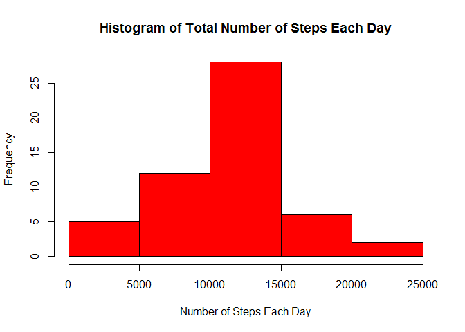
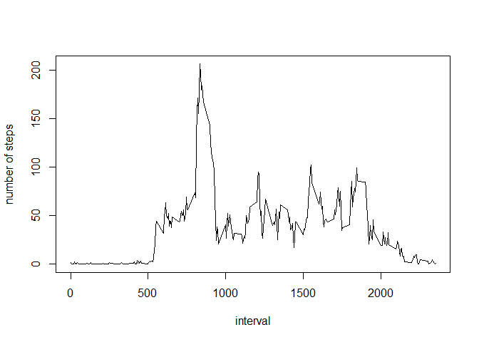
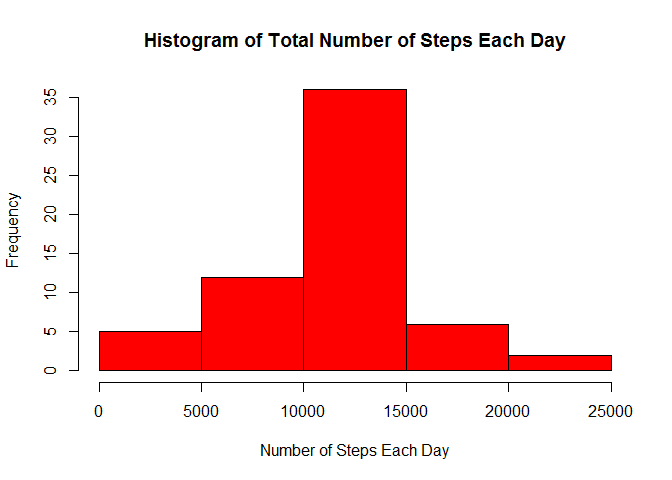
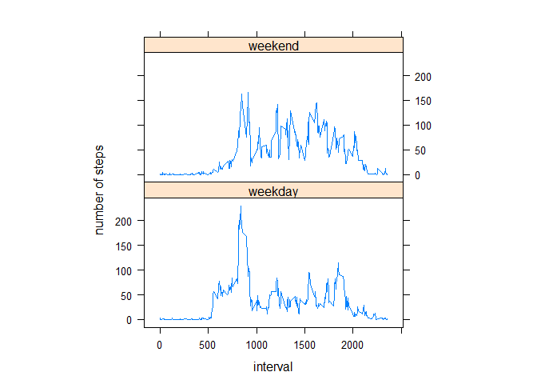

# Reproducible Research: Peer Assessment 1
ycdu  
Monday, October 13, 2014  


## Loading and preprocessing the data


```r
# extract the file if it's not extracted yet
if (!file.exists("activity.csv")){
  unzip("activity.zip", overwrite = FALSE)
  }

# load the data
data <- read.csv("activity.csv")

# Process/transform the date into Date format
data$date <- as.Date(data$date, format="%Y-%m-%d")
```

## What is mean total number of steps taken per day?

1.Make a histogram of the total number of steps taken each day


```r
# Get total number of steps taken each day and remove NAs
totalsteps<-aggregate(steps~date,data=data,sum,na.rm=TRUE)

# Plot a histogram 
hist(totalsteps$steps,main = "Histogram of Total Number of Steps Each Day",xlab = "Number of Steps Each Day", ylab = "Frequency", col = "red")
```

 

2. Calculate and report the mean and median total number of steps taken per day


```r
# Calculate the mean total number of steps taken per day
mean(totalsteps$steps)
```

```
## [1] 10766
```

```r
# Calculate the median total number of steps taken per day
median(totalsteps$steps)
```

```
## [1] 10765
```
* The **mean** total number of steps taken per day is **1.0766 &times; 10<sup>4</sup>** steps.
* The **median** total number of steps taken per day is **10765** steps.

## What is the average daily activity pattern?

1. Make a time series plot of the 5-minute interval (x-axis) and the average number of steps taken, averaged across all days (y-axis)

```r
# Get average number of steps per time interval, averaged across all days and remove the NAs
stepsinterval <- aggregate (steps~interval, data = data, mean, na.rm=TRUE)

# Plot the time series graph
plot(steps~interval,data = stepsinterval, type = "l", ylab = "number of steps")
```

 

2. Which 5-minute interval, on average across all the days in the dataset, contains the maximum number of steps?

```r
stepsinterval[which.max(stepsinterval$steps),]$interval
```

```
## [1] 835
```
The **835 interval** contains the maximum number of steps on average across all the days.

## Imputing missing values

1. Calculate and report the total number of missing values in the dataset (i.e. the total number of rows with NAs)

```r
sum(!complete.cases(data))
```

```
## [1] 2304
```

Total number of rows with NAs is 2304

2. Devise a strategy for filling in all of the missing values in the dataset.

* My strategy is to use the mean for that 5-minute interval across all days to fill in all the missing value.
* A function called `getsteps` is created below to get the mean for a particular 5-minute interval


```r
getsteps <- function (interval){
  stepsinterval[stepsinterval$interval==interval,]$steps
}
```

3. Create a new dataset that is equal to the original dataset but with the missing data filled in.

```r
# make a new data set
data2 <- data
# for all steps data with missing values, replace the NAs with the mean for that 5-minute interval
i <- 1
max <- length(data2$steps)
for (i in 1:max){
  if(is.na(data2[i,]$steps)){
    data2[i,]$steps = getsteps(data2[i,]$interval)
  }
  i <- i+1
}
```

4, Make a histogram of the total number of steps taken each day and Calculate and report the mean and median total number of steps taken per day. Do these values differ from the estimates from the first part of the assignment? What is the impact of imputing missing data on the estimates of the total daily number of steps?

a. Make a histogram of the total number of steps taken each day

```r
# Get total number of steps taken each day
totalsteps2<-aggregate(steps~date,data=data2,sum,na.rm=TRUE)

# Plot a histogram 
hist(totalsteps2$steps,main = "Histogram of Total Number of Steps Each Day",xlab = "Number of Steps Each Day", ylab = "Frequency", col = "red")
```

 

b. Calculate and report the mean and median total number of steps taken per day


```r
# Calculate the mean total number of steps taken per day
mean(totalsteps2$steps)
```

```
## [1] 10766
```

```r
# Calculate the median total number of steps taken per day
median(totalsteps2$steps)
```

```
## [1] 10766
```
* The **mean** total number of steps taken per day is **1.0766 &times; 10<sup>4</sup>** steps.
* The **median** total number of steps taken per day is **1.0766 &times; 10<sup>4</sup>** steps.

c. Do these values differ from the estimates from the first part of the assignment?

The **mean** is the same as the estimates from the first part of the assignment.
The **median** is slightly bigger than the estimates from the first part of the assignment. 

d. What is the impact of imputing missing data on the estimates of the total daily number of steps?

The total daily number of steps is about the same as the value before imputing missing data because we replace the missing values with the mean value for that particular 5-min interval.

## Are there differences in activity patterns between weekdays and weekends?

1. Create a new factor variable in the dataset with two levels - "weekday" and "weekend" indicating whether a given date is a weekday or weekend day.


```r
dayofweek <- weekdays(data2$date)
data2$dayofweek <- as.factor(ifelse(dayofweek %in% c("Saturday", "Sunday"),"weekend","weekday"))
```

2. Make a panel plot containing a time series plot (i.e. type = "l") of the 5-minute interval (x-axis) and the average number of steps taken, averaged across all weekday days or weekend days (y-axis).


```r
# Get average number of steps per time interval, averaged across all days 
stepsinterval2 <- aggregate (steps~interval+dayofweek, data = data2, mean)

# Plot the time series graph
library(lattice)
xyplot(steps~interval|factor(dayofweek),data = stepsinterval2, type = "l",aspect=1/2, ylab = "number of steps")
```

 
